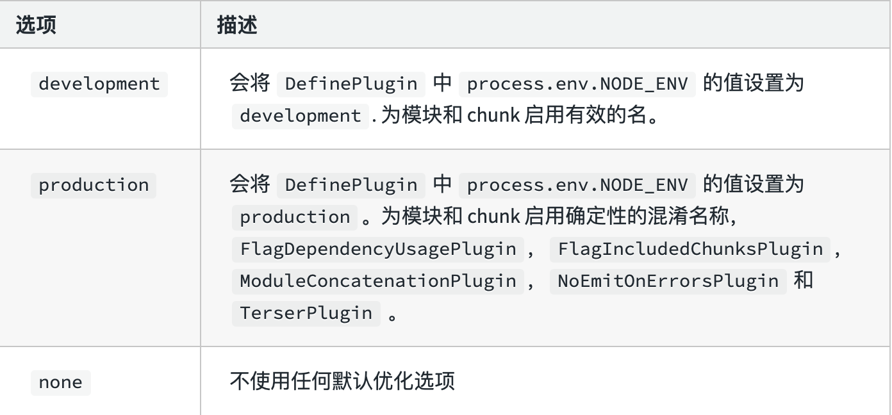

> 往后的学习环境，Node版本 10+

## webpack是一个前端构建工具

### 1. 创建 index.html 文件

```HTML
<!DOCTYPE html>
<html lang="en">
<head>
  <meta charset="UTF-8">
  <meta http-equiv="X-UA-Compatible" content="IE=edge">
  <meta name="viewport" content="width=device-width, initial-scale=1.0">
  <!-- 直接将样式文件引入，打开页面发现不生效，因为浏览器本身是不能识别less文件的，需要一个工具将less代码编译成css -->
  <link rel="stylesheet" href="./index.less">
  <title>webpack简介</title>
</head>
<body>
  <h1 id="title">Hello Webpack!!</h1>

  <!-- 直接引入会在浏览器报错 `Uncaught SyntaxError: Cannot use import statement outside a module`, 因为js文件中有些语法浏览器可能并不能识别，需要工具去进行编译 -->
  <script src="./index.js"></script>
</body>
</html>
```

### 2. 创建 index.less 文件

```less
html, body {
  padding: 0;
  margin: 0;
  background-color: pink;

  #title {
    color: #FFF;
  }
}
```

在 index.html 文件中引入 less 文件，在浏览器中打开 index.html 发现 index.less 文件并没有生效

### 3. 创建 index.js 文件

```js
// 前置：在目录中执行 npm init ，并下载jquery
import $ from 'jquery'

$('#title').click(() => {
  $('body').css('backgroundColor', 'deeppink')
})
```

在浏览器中刷新页面发现同样没有生效，并且在控制台报错 `Uncaught SyntaxError: Cannot use import statement outside a module`

<font color="#FF0000">less 文件与 js 文件不生效是因为浏览器本身并不能识别less语法以及ES6的import语法等。需要一个工具进行编译转换成浏览器可以识别的语法，但是针对不同的的文件类型用不同的工具又很繁琐，所以就有了webpack，他负责将多种文件类型的编译都整合到了一起，将他们统一进行构建。</font>

## webpack是一个静态模块打包器

在项目中定义一个入口文件，webpack 会从<font color="#FF0000">入口文件</font>开始将所有的资源文件（js/json/css/img/...）作为模块处理，他将根据模块的依赖关系（比如import导入外部文件即存在依赖关系）组合成一个chunk，再对代码块进行各项处理（对各种文件进行编译，可以让浏览器识别）生成bundle文件。将chunk编译生成bundle的过程就是打包。

## webpack五个核心概念

### 1. entry

入口，指示 webpack 以哪个文件作为入口起点开始打包，分析构建内部依赖图。

### 2. output

输出，指示webpack打包后的资源bundle输出到哪里，以及如何命名。

### 3. loader

Loader 让 Webpack 能够去处理那些非JS文件（webpack本身只能理解JS/json）。

<font color="red">例如遇到 less 文件， scss 文件 ==</font>

### 4. plugins

插件可以用于执行范围更广的任务，插件的范围包括从打包优化和压缩，一直到重新定义环境中的变量等。

<font color="red">例如遇到一些图片资源 ==</font>

### 5. mode

Mode 指示 webpack 使用相应模式的配置（不同模式会默认启用一些插件）



如果没有设置，webpack 会给 mode 的默认值设置为 `production`