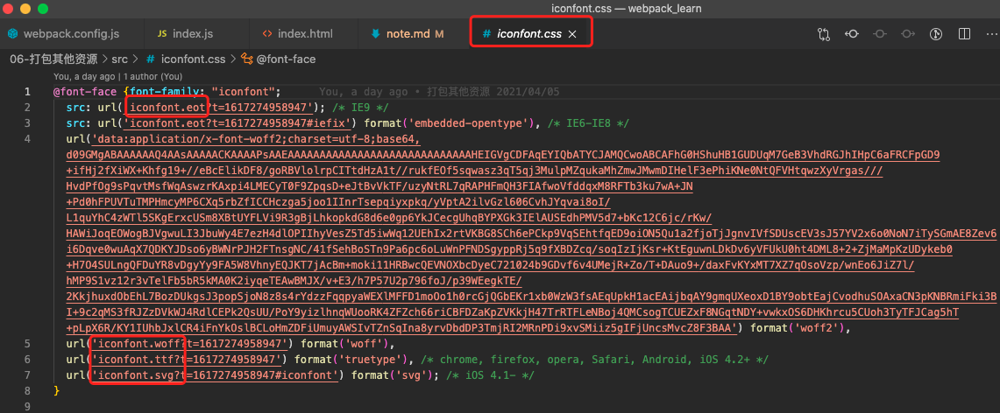

> 这里的学习是除了之前涉及到的js、json、css、图片、html等资源外，其他的资源打包(如：字体文件，icon文件等)。这里以引入阿里的图标 iconfont 为例。

## 准备 icon 图标文件

- 到阿里 icon 图标库下载几个图标
  ```
  打开https://www.iconfont.cn/  ===> 随便将几个图标添加到购物车  ===>  在购物车下载代码
  ```

## 创建 src/index.html

按照下载 icon 文件中图标的使用说明，在 html 页面中添加图标展示元素。（我下载了三个，所以只写了三个元素）

```html
<!DOCTYPE html>
<html lang="en">
<head>
  <meta charset="UTF-8">
  <meta http-equiv="X-UA-Compatible" content="IE=edge">
  <meta name="viewport" content="width=device-width, initial-scale=1.0">
  <title>Document</title>
</head>
<body>
  <span class="iconfont icon-aixin"></span>
  <span class="iconfont icon-chenggong"></span>
  <span class="iconfont icon-dianyingpiao"></span>
</body>
</html>
```

## 创建 src/index.js 入口文件

将下载的 icon 文件中图标的样式文件引入

```js
// 引入样式文件

import './iconfont.css'
```

查看 iconfont.css 样式文件，可以看到其中还引入了一些其他的文件，在下载的 font 文件夹中找到并放到 iconfont.css 同一目录下(这里统一都放在 src 下)



## 创建 webpack.config.js 配置文件

通过对 file-loader 的配置，支持对其他资源的打包

```js
const { resolve } = require('path');
const HtmlWebpackPlugin = require('html-webpack-plugin');

module.exports = {
  entry: './src/index.js',
  output: {
    filename: 'built.js',
    path: resolve(__dirname, 'build')
  },
  module: {
    rules: [
      {
        test: /\.css$/,
        use: [
          'style-loader',
          'css-loader'
        ]
      },
      // 打包其他资源的loader
      {
        // 之前使用 test匹配文件，也可以使用 exclude 去排除文件，然后打包排除剩下的
        exclude: /\.(html|css|js)$/,
        loader: 'file-loader',
        options: {
          name: '[hash:10].[ext]'
        }
      }
    ]
  },
  plugins: [
    new HtmlWebpackPlugin(
      {
        template: './src/index.html'
      }
    )
  ],
  mode: 'development'
}
```

使用 `webpack` 命令成功打包，在浏览器打开 build/index.html 可以看到图标展示。