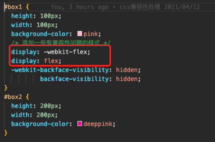

> - 将 `09-提取css成单独文件` 中的 src 目录复制一份
> 
> - 想要处理 css 的兼容性问题，需要用到 postcss 库，而在 webpack 中想要使用 postcss 则需要下载 postcss-loader 以及 postcss-prset-env
>   - postcss-loader <font color="ff0000">调用插件</font>将需要添加兼容性前缀的样式添加兼容性前缀
>   - postcss-preset-env 帮 postcss 找到 package.json 文件中的 browserslist 配置，根据配置加载指定的css兼容性样式
>   - 下载 postcss-loader postcss-preset-env `npm i postcss-loader postcss-preset-env -D`
>   - 可以到 [postcss 官网](https://www.postcss.com.cn/) 查看更多插件及配置
>   - 可以到 github 搜索 [browserslist](https://github.com/browserslist/browserslist) 查看更多配置

## 修改 webpack.config.js

注意 postcss-loader 不同版本有不同的配置方式。旧版本的直接在 options 中配置 plugins，新版本的需要新建 postcss.config.js 文件。

```js
const HtmlWebpackPlugin = require('html-webpack-plugin');
const MiniCssExtractPlugin = require('mini-css-extract-plugin')
const { resolve } = require('path');

module.exports = {
  entry: './src/js/index.js',
  output: {
    filename: 'js/built.js',
    path: resolve(__dirname, 'build')
  },
  module: {
    rules: [
      {
        test: /\.css$/,
        use: [
          MiniCssExtractPlugin.loader,
          'css-loader',
          {
            loader: 'postcss-loader',
            // options: {
            //   ident: 'postcss',
            //   plugins: () => [
            //     // postcss 的插件
            //     require('postcss-preset-env')()
            //   ]
            // }
          }
        ]
      }
    ]
  },
  plugins: [
    new HtmlWebpackPlugin({
      template: './src/index.html'
    }),
    new MiniCssExtractPlugin({
      filename: 'style/built.css'
    })
  ],
  mode: 'development'
}
```

## postcss.config.js 文件

```js
module.exports = {
  plugins: [
    require('postcss-preset-env')()
  ]
}
```

## 在 package.json 中配置 browserslist

可以到 github 搜索 [browserslist](https://github.com/browserslist/browserslist) 查看更多配置

```json
{
  "name": "webpack_learn",
  "version": "1.0.0",
  "description": "",
  "main": "index.js",
  "scripts": {
    "test": "echo \"Error: no test specified\" && exit 1"
  },
  "repository": {
    "type": "git",
    "url": "git+https://github.com/xuexiaoboo/webpack_learn.git"
  },
  "keywords": [],
  "author": "",
  "license": "ISC",
  "bugs": {
    "url": "https://github.com/xuexiaoboo/webpack_learn/issues"
  },
  "homepage": "https://github.com/xuexiaoboo/webpack_learn#readme",
  "devDependencies": {
    "css-loader": "^5.1.3",
    "file-loader": "^6.2.0",
    "html-loader": "^2.1.2",
    "html-webpack-plugin": "^5.3.1",
    "less": "^4.1.1",
    "less-loader": "^8.0.0",
    "mini-css-extract-plugin": "^1.4.1",
    "postcss-loader": "^5.2.0",
    "postcss-preset-env": "^6.7.0",
    "style-loader": "^2.0.0",
    "url-loader": "^4.1.1",
    "webpack": "^5.28.0",
    "webpack-cli": "^3.3.11",
    "webpack-dev-server": "^3.11.2"
  },
  "dependencies": {},
  "browserslist": {
    "development": [
      "last 1 chrome version",
      "last 1 firefox version",
      "last 1 safari version"
    ],
    "production": [
      ">0.2%",
      "not dead",
      "not op_mini all"
    ]
  }
}
```

这里配置了 `development` 和 `production` 两个环境的配置，postcss-preset-env <font color="ff0000">默认</font>匹配 `production` 中的配置，如果想让他去匹配 `development` 中的配置，需要再 webpack.config.js 中使用 `process.env.NODE_ENV = "development"` 修改 Node 的环境变量。不进行任何设置则默认根据 production 进行样式兼容。

```js
const HtmlWebpackPlugin = require('html-webpack-plugin');
const MiniCssExtractPlugin = require('mini-css-extract-plugin')
const { resolve } = require('path');

// 设置node环境变量
process.env.NODE_ENV = "development"

module.exports = {
  entry: './src/js/index.js',
  output: {
    filename: 'js/built.js',
    path: resolve(__dirname, 'build')
  },
  module: {
    rules: [
      {
        test: /\.css$/,
        use: [
          MiniCssExtractPlugin.loader,
          'css-loader',
          {
            loader: 'postcss-loader',
            // options: {
            //   ident: 'postcss',
            //   plugins: () => [
            //     // postcss 的插件
            //     require('postcss-preset-env')()
            //   ]
            // }
          }
        ]
      }
    ]
  },
  plugins: [
    new HtmlWebpackPlugin({
      template: './src/index.html'
    }),
    new MiniCssExtractPlugin({
      filename: 'style/built.css'
    })
  ],
  mode: 'development'
}
```

## 在样式文件中添加几个有兼容性问题的样式

```css
/* a.css */
#box1 {
  height: 100px;
  width: 100px;
  background-color: pink;
  /* 添加一些有兼容性问题的样式 */
  display: flex;
  backface-visibility: hidden;
}
```

使用 `webpack` 打包，并查看打包后的样式文件

切换Node环境变量，查看 postcss-preset-env 在不同配置下加载的兼容性样式

`development` 打包输出


`production` 打包输出
