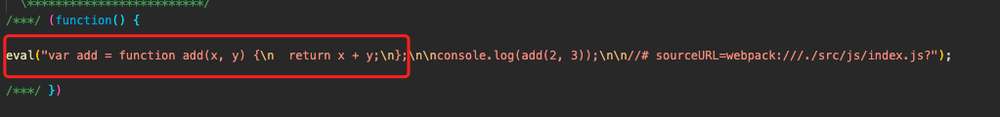

> 12-js语法检查 复制一份

## 1. 基本兼容性处理

### 修改 src/js/index.js 文件

使用一些对浏览器版本有兼容性问题的语法

```js
// 使用箭头函数，对于一些低版本浏览器不支持
const add = (x, y) => {
  return x + y;
}

console.log(add(2, 3));
```

### 下载包并修改 webpack.config.js

下载依赖包 `npm i babel-loader @babel/preset-env @babel-core -D`

修改 webpack.config.js 文件,配置 babel-loader

```js
const { resolve } = require('path');
const HtmlWebpackPlugin = require('html-webpack-plugin');

module.exports = {
  entry: './src/js/index.js',
  output: {
    filename: 'js/built.js',
    path: resolve(__dirname, 'build')
  },
  module: {
    rules: [
      {
        test: /\.js$/,
        loader: 'babel-loader',
        options: {
          presets: ['@babel/preset-env']
        }
      }
    ]
  },
  plugins: [
    new HtmlWebpackPlugin({
      template: './src/index.html'
    })
  ],
  mode: 'development'
}
```

使用 `webpack` 打包，查看 build/js/built.js 文件，与 src/js/index.js 比较



在浏览器查看 build/index.html ，可以正常显示，浏览器控制台也可正常输出。

这样的配置只能解决基本的 js 语法兼容性，不能解决更高级的 js

修改 src/js/index.js 文件

```js
const add = (x, y) => {
  return x + y;
}

const promise = new Promise((resolve, reject) => {
  setTimeout(() => {
    console.log('定时器执行完了~');
    resolve();
  }, 1000)
})

console.log(promise);

console.log(add(2, 3));
```

使用 `webpack` 打包，查看 build/js/built.js 文件。<font color="ff0000">现在打包的js文件大小为 1.46kib</font>

在本地chrome中可以正常执行，但是放到低版本的 ie 中则会报错，不识别 Promise。

## 2. 全部js语法兼容

下载依赖 `@babel/polyfill`

在 src/js/index.js 中引入 `import @babel/polyfill`

使用 `webpack` 打包，查看 build/js/built.js 文件。<font color="ff0000">现在打包的js文件大小为 446 KiB。包的体积明显增大</font>

查看 build/js/built.js，发现当中被添加了很多关于兼容性的内容。在本地chrome以及低版本 ie 都可以正常访问。(但缺点显而易见)

## 3. 全部js语法兼容（按需引入）

下载依赖 `core-js`

修改 webpack.config.js 文件

```js
const { resolve } = require('path');
const HtmlWebpackPlugin = require('html-webpack-plugin');

module.exports = {
  entry: './src/js/index.js',
  output: {
    filename: 'js/built.js',
    path: resolve(__dirname, 'build')
  },
  module: {
    rules: [
      {
        test: /\.js$/,
        exclude: /node_modules/,
        loader: 'babel-loader',
        options: {
          presets: [
            [
              '@babel/preset-env',
              {
                // 按需加载配置
                useBuiltIns: 'usage',
                // 指定core-js版本
                corejs: {
                  version: 3
                },
                // 指定兼容的浏览器版本下限
                // 如果不设置，@babel/preset-env 会使用 browserslist 的配置
                targets: {
                  chrome: '60',
                  firefox: '60',
                  ie: '9',
                  safari: '10',
                  edge: '17'
                }
              }
            ]
          ]
        }
      }
    ]
  },
  plugins: [
    new HtmlWebpackPlugin({
      template: './src/index.html'
    })
  ],
  mode: 'development'
}
```

使用 `webpack` 打包，查看 build/js/built.js 文件。<font color="ff0000">现在打包的js文件大小为 297 KiB。