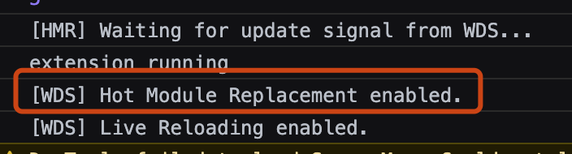
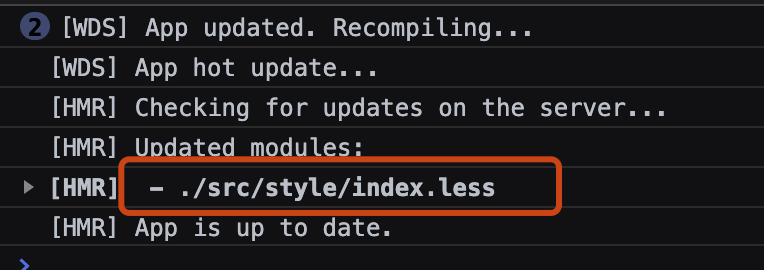
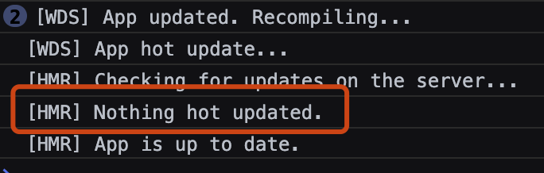

> 08-开发环境配置 复制一份
>
> 在之前的配置基础上需要添加 target 属性，让 devServer 可以在浏览器自动刷新

现在去尝试修改 js 文件，css 文件，页面都可以正常刷新，但是同时也可以发现他是<font color="ff0000">整个</font>页面的刷新，他将项目中的所有模块全部进行了重新的打包编译，在项目复杂，模块数量多的项目中，是十分消耗性能的。

通过使用 HMR（hot modules replacement 热模块替换）来实现修改模块的更新，而不是全部模块的更新

## 修改 webpack.config.js 文件

在 devServer 的配置项中添加 hot:true，开启HMR

```js
/**
 * 开发环境的配置
 */

const HtmlWebpackPlugin = require('html-webpack-plugin');
const { resolve } = require('path');

module.exports = {
  entry: './src/js/index.js',
  output: {
    filename: 'js/built.js',
    path: resolve(__dirname, 'build'),
  },
  module: {
    rules: [
      // loader 配置
      {
        // 处理样式资源, 这里以 less 为例
        test: /\.less$/,
        use: [
          'style-loader',
          'css-loader',
          'less-loader',
        ],
      },
      {
        test: /\.css$/,
        use: [
          'style-loader',
          'css-loader',
        ],
      },
      {
        // 处理图片资源, 这个配置只能处理样式文件中引入的图片资源，不能处理img标签中的图片
        test: /\.(jpg|png|gif)$/,
        loader: 'url-loader',
        options: {
          limit: 20 * 1024,
          name: '[hash:10].[ext]',
          esModule: false,
          outputPath: 'imgs',
        },
      },
      {
        // 这个 loader 的配置可以处理 html 文件中的img标签
        test: /\.html$/,
        loader: 'html-loader',
        options: {
          esModule: false,
        },
      },
      {
        // 处理其他资源
        exclude: /\.(less|html|jpg|png|gif|js|css)$/,
        loader: 'file-loader',
        options: {
          name: '[hash:10].[ext]',
          outputPath: 'media',
        },
      },
    ],
  },
  plugins: [
    // plugins 插件配置，切记是数组
    new HtmlWebpackPlugin({
      template: './src/index.html',
    }),
  ],
  mode: 'development',
  target: 'web',
  devServer: {
    contentBase: resolve(__dirname, 'build'),
    compress: true,
    open: true,
    port: 3000,
    hot: true,
  },
};
```

重新启动 devServer `npx webpack-dev-server`，在浏览器控制台可以看到 HMR 已经启动了


### 1. HMR-样式文件

- 操作：
  
  修改 src/style/index.less，查看控制台输出,可以看到 HMR 只更新了修改的 less 文件，其他 js 文件中的打印并没有重新执行


- 结论：
  
  样式文件可以直接适配 HMR 的配置，因为在 style-loader 中已经使用 `module.hot.accept` 实现了，这也是为什么在开发环境中使用 style-loader(可以帮助我们提升开发效率)，而在生产环境中要使用 `mini-css-extract-plugin` 将样式文件抽离成单独的文件。

### 2. HMR-html文件

- 操作：
  
  修改 src/index.html 文件，查看控制台输出，HMR并没有识别到有模块更新


- 问题：
  
  之前没有开 HMR 之前，整个页面会刷新，现在也不行了

- 解决：
  
  修改 webpack.config.js 中的 entry 配置，将入口文件改成数组，并添加 html 文件的路径

  ```js
  /**
   * 开发环境的配置
   */

  const HtmlWebpackPlugin = require('html-webpack-plugin');
  const { resolve } = require('path');

  module.exports = {
    entry: ['./src/js/index.js', './src/index.html'],
    output: {
      filename: 'js/built.js',
      path: resolve(__dirname, 'build'),
    },
    module: {
      rules: [
        // loader 配置
        {
          // 处理样式资源, 这里以 less 为例
          test: /\.less$/,
          use: [
            'style-loader',
            'css-loader',
            'less-loader',
          ],
        },
        {
          test: /\.css$/,
          use: [
            'style-loader',
            'css-loader',
          ],
        },
        {
          // 处理图片资源, 这个配置只能处理样式文件中引入的图片资源，不能处理img标签中的图片
          test: /\.(jpg|png|gif)$/,
          loader: 'url-loader',
          options: {
            limit: 20 * 1024,
            name: '[hash:10].[ext]',
            esModule: false,
            outputPath: 'imgs',
          },
        },
        {
          // 这个 loader 的配置可以处理 html 文件中的img标签
          test: /\.html$/,
          loader: 'html-loader',
          options: {
            esModule: false,
          },
        },
        {
          // 处理其他资源
          exclude: /\.(less|html|jpg|png|gif|js|css)$/,
          loader: 'file-loader',
          options: {
            name: '[hash:10].[ext]',
            outputPath: 'media',
          },
        },
      ],
    },
    plugins: [
      // plugins 插件配置，切记是数组
      new HtmlWebpackPlugin({
        template: './src/index.html',
      }),
    ],
    mode: 'development',
    target: 'web',
    devServer: {
      contentBase: resolve(__dirname, 'build'),
      compress: true,
      open: true,
      port: 3000,
      hot: true,
    },
  };
  ```

  重新启动 devServer `npx webpack-dev-server`，并修改 html 文件内容，查看浏览器控制台，可以发现，仍然是整个页面全部刷新。

- 结论：
  
  html 文件不能使用 HMR 功能。因为在项目开发中只有一个 html 文件，而不会像 js 文件那样存在多个模块，这一个 html 文件变化，就可以说是根文件发生了变化，肯定是要全部刷新的。HMR 似无必要。

### 3. HMR-js

- 操作：
  
  新添加一个 js 文件(模块) src/js/print.js

  ```js
  function print() {
    const content = 'print.js 文件被执行了~~';
    console.log(content);
  }

  export default print;
  ```

  在 src/js/index.js 中引入并使用

  ```js
  import '../style/iconfont.css';
  import '../style/index.less';
  import print from './print';

  console.log('index.js 被执行了~~');

  print();

  function add(x, y) {
    return x + y;
  }

  console.log(add(2, 5));
  ```

- 问题：
  
  分别修改这两个 js 文件，在浏览器控制台查看，会发现，整个页面都更新了

- 解决：
  
  修改 src/js/index.js 文件

  ```js
  import '../style/iconfont.css';
  import '../style/index.less';
  import print from './print';

  console.log('index.js 被执行了~~');

  print();

  function add(x, y) {
    return x + y;
  }

  console.log(add(2, 2));

  if (module.hot) {
    // 一旦 module.hot 为 true，说明开启了 HMR 功能
    module.hot.accept('./print.js', () => {
      // 该方法会监听 print.js 文件的变化，一旦发生变化，会重新打包该文件而其他文件不会重新打包
      // 只能处理非入口文件的其他js模块，与html文件同理，入口js文件变化，相当于根文件变化，其他js模块必然会重新加载打包
      print();
    });
  }
  ```

  修改 print.js 文件，在浏览器控制台查看，可以看到，HMR 对于 print.js 文件生效了，index.js 文件并没有重新执行

  注：只能处理非入口文件的其他js模块，与html文件同理，入口js文件变化，相当于根文件变化，其他js模块必然会重新加载打包

  ***

  注~注~注: 原本开启 HMR 需要在 plugins 中 添加  `new webpack.HotModuleReplacementPlugin()` 来完全开区 HMR ，但是这里没写也可以成功开启 HMR，是因为 `webpack-dev-server` 这个插件内部对这个插件的配置进行检查，如果没有配置他会自动添加这个插件。所以如果使用 `weboack-dev-server` 之外的插件开启服务的话或许还是要手动引入这个plugin


