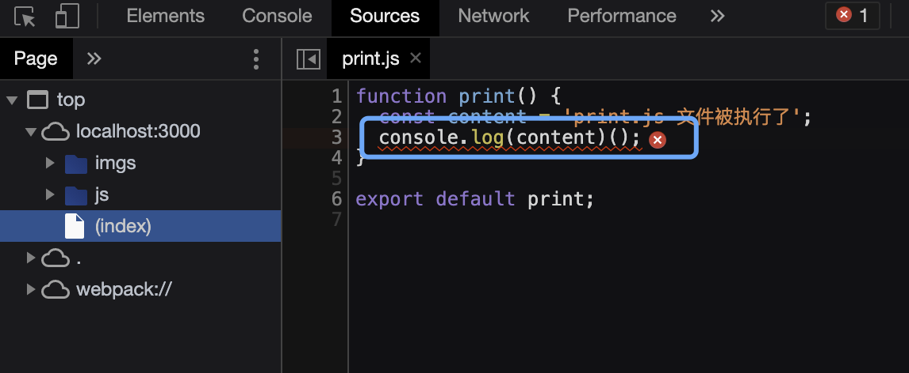

> 17-HMR 复制一份
>
> source-map 是一种提供源代码到构建后代码映射的技术（如果构建后代码出错了，通过映射可以追踪到源代码错误）

## devtool启用 source-map 的模式

> 不要混淆模式字符串顺序
>
> `[inline-|hidden-|eval-][nosources-][cheap-[module-]]source-map`
> 
> 其中一些值适用于开发环境，一些适用于生产环境。对于开发环境，通常希望更快速的 source map，需要添加到 bundle 中以增加体积为代价，但是对于生产环境，则希望更精准的 source map，需要从 bundle 中分离并独立存在。

提前将 src/js/print.js 文件中修改处错误，方便后边插件不同 source-map 模式下的映射差别

### 1. 'source-map' 模式（外部）

> 在 webpack.config.js 中配置 devtool `devtool: 'source-map'`，使用 `npx webpack-dev-server` 启动项目，查看控制台报错。

- 使用 `webpack` 打包。会在 build/js 目录下生成 .map 文件，生成的 .map 文件提供了源代码和构建后代码的映射关系
- 它可以显示错误代码的准确信息，并映射到源代码的错误位置

### 2.`inline-source-map` 模式（内联）

- 使用 `webpack` 打包。会在 build/js/built.js 文件中生成 base64 形式的映射关系。内联比外部生成文件构建速度更快
- 显示与映射错误信息与 `source-map` 一致

### 3. `hidden-source-map` 模式（外部）

- 会生成 .map 文件
- 显示代码错误原因，但是不会映射到源代码的错误位置，会映射到构建后代码相对应的错误位置

### 4. `eval-source-map` 模式（内联）

- 会在构建后代码中每一个文件后边生成 map 信息，都在 eval 函数中
- 显示与映射错误信息与 `source-map` 一致

### 5. `nosources-source-map` 模式（外部）

- 生成外部 map 文件
- 显示错误信息与错误位置，但是点进去不会显示任何代码

### 6. `cheap-source-map` 模式（外部）

- 生成外部 map 文件
- 显示错误信息，也可以映射到错误源代码，但是只能映射到 ’行‘，而不会精确识别 ’列‘

### 7. `cheap-module-source-map` 模式（外部）

- 生成外部 map 文件
- 显示错误信息，也可以映射到错误源代码，但是只能映射到 ’行‘，而不会精确识别 ’列‘，与cheap的区别是，他会将loader的source map 加入

## 适用场景

### 1. 环境构建要求

- 开发环境: 速度快，调试更友好
  
  速度快：eval > inline > cheap > ...

  一般采用 `eval-source-map` , 要想更快，更友好可以使用 `eval-cheap-module-source-map`,脚手架里的默认使用 `eval-source-map`

- 生产环境: 源代码要不要隐藏，调试要不要更友好
  
  内联的方式会让代码体积变大，一般不采用内联

  一般使用 `source-map` / `cheap-module-source-map`，

  如果需要隐藏代码，可以考试使用 `nosources-source-map` / `hidden-source-map`

