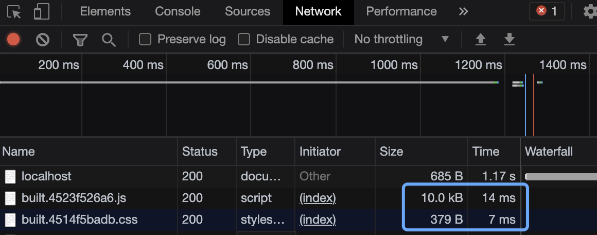

> 缓存从两个方面做
> 1. 从babel方面做缓存（babel 负责将 js 代码编译成浏览器可以识别的代码）
>   - 在 js 文件比较多的时候。修改一个文件，再次构建。babel需要将所有文件再做一次兼容性编译，我们需要只编译改变的文件（类似HMR），但是由于HMR依赖于devServer。生产环境又不能使用HMR，所以需要对其做缓存处理
> 2. 从项目资源方面做缓存
>   - 启动项目，查看页面 Network，发现每次刷新页面都会重新加载请求js、css等资源。

## 创建目录结构

```
|-- src
| |
| |--- js
| |  |-- index.js
| |
| |--- style
| |  |-- index.css
| |
| |-- index.html
| 
|-- webpack.config.js
|
|--server.js
```

1. src/js/index.js
  ```js
  import '../style/index.css';

  function sum(...args) {
    return args.reduce((p, c) => p + c, 0);
  }

  // eslint-disable-next-line
  console.log(sum(1, 2, 3, 4, 5));
  ```

2. src/style/index.css
  ```css
  html, body {
    margin: 0;
    padding: 0;
    height: 100%;
    background-color: pink;
  }
  ```

3. src/index.html
  ```html
  <!DOCTYPE html>
  <html lang="en">
  <head>
    <meta charset="UTF-8">
    <meta http-equiv="X-UA-Compatible" content="IE=edge">
    <meta name="viewport" content="width=device-width, initial-scale=1.0">
    <title>Document</title>
  </head>
  <body>
    <h1>hello cache</h1>
  </body>
  </html>
  ```

4. server.js

  需要先下载 `express`

  ```js
  // eslint-disable-next-line
  const express = require('express')

  const app = express();

  app.use(express.static('build', maxAge: { 1000 * 3600 }));

  app.listen(3000);
  ```

5. webpack.config.js

  给 babel-loader 添加 `cacheDirectory: true` 的配置，就可以开启 babel 的缓存。

  ```js
  const { resolve } = require('path');
  const HtmlWebpackPlugin = require('html-webpack-plugin');
  // css抽离成单独文件
  const MiniCssExtractPlugin = require('mini-css-extract-plugin');
  // css压缩
  const OptimizeCssAssetsWebpackPlugin = require('optimize-css-assets-webpack-plugin');

  process.env.NODE_ENV = 'production';

  const commonCssLoader = [
    MiniCssExtractPlugin.loader,
    'css-loader',
    {
      // css 兼容性处理，外部添加postcss配置文件以及package.json中定义browserslist,以及修改node环境，匹配browserslist
      loader: 'postcss-loader',
    },
  ];

  module.exports = {
    entry: './src/js/index.js',
    output: {
      filename: 'js/built.js',
      path: resolve(__dirname, 'build'),
    },
    module: {
      rules: [
        {
          // js 格式校验。因为使用airbnb的校验规则，需要在外部创建 .eslint 配置文件，或在 package.json 中配置
          // 当有两个loader同时处理同一类文件时，一定要规定好，处理的先后,这里先执行eslint，后执行babel
          test: /\.js$/,
          exclude: /node_modules/,
          // 优先执行
          enforce: 'pre',
          loader: 'eslint-loader',
          options: {
            fix: true,
          },
        },
        {
          // 一下loader只会匹配一个
          // 注意不能两个loader处理同类文件
          oneOf: [
            {
              test: /\.css$/,
              use: [
                // 'style-loader',
                // MiniCssExtractPlugin.loader,
                // 'css-loader',
                // {
                //   css 兼容性处理，外部添加postcss配置文件以及package.json中定义browserslist,以及修改node环境，匹配browserslist
                //   loader: 'postcss-loader',
                // },
                ...commonCssLoader,
              ],
            },
            {
              test: /\.less$/,
              use: [
                // MiniCssExtractPlugin.loader,
                // 'css-loader',
                // {
                //   loader: 'postcss-loader',
                // },
                ...commonCssLoader,
                'less-loader',
              ],
            },
            {
              // js 兼容性处理
              test: /\.js$/,
              exclude: /node_modules/,
              loader: 'babel-loader',
              options: {
                presets: [
                  [
                    '@babel/preset-env',
                    {
                      // 按需加载配置
                      useBuiltIns: 'usage',
                      corejs: { version: 3 },
                      // 指定兼容的浏览器版本下限
                      targets: {
                        chrome: '60',
                        firefox: '60',
                        ie: '9',
                        safari: '10',
                        edge: '17',
                      },
                    },

                  ],
                ],
                // 开启babel缓存
                // 第二次构建时，未改变的文件会读取之前的缓存
                cacheDirectory: true,
              },
            },
            {
              test: /\.(png|jpg|gif)/,
              loader: 'url-loader',
              options: {
                limit: 8 * 1024,
                name: '[hash:10].[ext]',
                outputPath: 'imgs',
                esModule: false,
              },
            },
            {
              test: /\.html$/,
              loader: 'html-loader',
              options: {
                esModule: false,
              },
            },
            {
              exclude: /\.(js|css|less|html|jpg|png|gif)$/,
              loader: 'file-loader',
              options: {
                outputPath: 'media',
              },
            },
          ],
        },
      ],
    },
    plugins: [
      new HtmlWebpackPlugin({
        template: './src/index.html',
        minify: {
          // 压缩空格
          collapseWhitespace: true,
          // 去除注释
          removeComments: true,
        },
      }),
      new MiniCssExtractPlugin(
        {
          filename: 'style/built.css',
        },
      ),
      new OptimizeCssAssetsWebpackPlugin(),
    ],
    mode: 'production',
    devtool: 'source-map',
  };
  ```

## 缓存效果

- 将项目打包，使用 `node server.js` 启动服务文件，访问 `https://localhost:3000` 查看页面，查看 Network

- 启动服务第一次进入页面，资源是加载的。
  

- 刷新页面，资源会从缓存中拿，加载速度更快。
  

## 配置缓存造成的问题

- 问题：由于资源文件每次打包后的文件名相同，若修改某一文件内容，重新打包后，浏览器检测不到文件变化，还是会从缓存中拿资源文件，导致修改无法同步体现在页面上。
- 解决：对于修改前与修改后的文件设置不同的打包输出名称，让浏览器可以区分，文件更改，从而重新加载。
  - \[hash:10\]: 为输出文件名称添加此次打包过程生成的唯一hash值
     每次打包的hash值是唯一的，每次都不同，用\[hash:10\]会导致缓存失效，因为每次hash值都不一样，每次浏览器检测文件都是新的，都会去重新加载。
   
  - \[chunkhash:10\]: 打包过程会为每一个chunk生成一个hash值，但是同属于同一个chunk的文件会在其中一个文件修改的同时也随之变更hash值，就会导致，同一chunk中一个文件修改，其他文件也重新加载的情况。

  - \[contenthash:10\]: 根据打包文件内容生成hash值，内容修改，hash值变更，内容保持不变，多次打包hash值也不变，所以配置缓存时的输出文件名一般加 \[contenthash:10\] 的标识。（详见webpack.config.js配置 22行 & 138行）